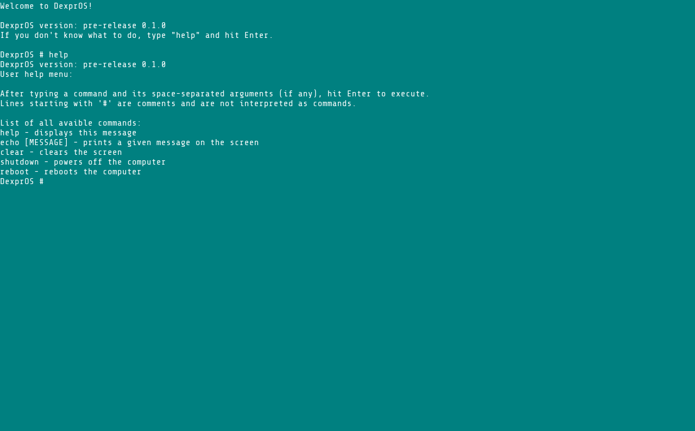

# DexprOS

A simple operating system for x86-64 UEFI machines written in C and assembly. Made as an experiment to see if I could actually develop something so low-level as an OS.

## What is it capable of?

For now, DexprOS is able to:
- setup graphics using UEFI Graphics Output Protocol,
- exit UEFI boot services,
- load a working General Descriptor Table and Interrupt Descriptor Table,
- setup PIC (Programmable Interrupt Controller) and PS/2 controller,
- handle keyboard input and convert it to unicode characters,
- process a few commands in a simple shell: echo, clear, help, shutdown, reboot.

## Planned features

As DexprOS is just an experiment and my focus goes mainly to other projects, new features may be introduced slowly over time.  
Here are my upcoming plans:
- Paging (UEFI leaves us with a fully working paging setup, but you need your own one to be able to go to userspace and allocate memory yourself),
- syscalls,
- userspace code execution,
- parsing some ACPI structures.

## Compiling

The only officially supported compiler is 64-bit MinGW. Within the `cmake/cross-compile-toolchains` directory, there is a CMake Toolchain file to easily cross-compile the code on Linux if you have MinGW installed.  
You can use CMake directly or execute the `build.bash` script if you're running Linux.

## Running

To run on real hardware, create a bootable FAT32 partition on a USB drive. Then copy the `BOOTX64.EFI` file from your build directory to `/EFI/BOOT/BOOTX64.EFI` on your USB.

You can also use the `generate-iso.bash` script to generate a disk image that you can run under QEMU.

## Dependencies

### Code:

- GNU EFI (bundled with the project itself in `third-party/gnu-efi-code`),

### Building:

- MinGW compiler,
- CMake build system.
